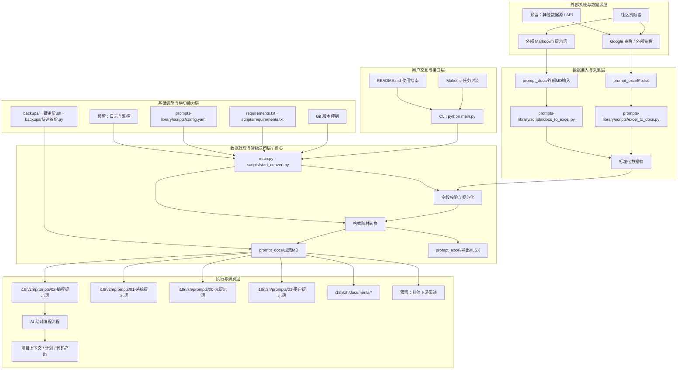
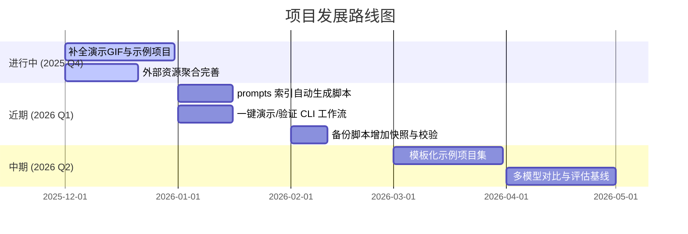

<!--
-------------------------------------------------------------------------------
  项目头部区域 (HEADER)
-------------------------------------------------------------------------------
-->
<p align="center">
  <!-- 建议尺寸: 1280x640px。可以使用 Canva, Figma 或 https://banners.beyondco.de/ 等工具制作 -->
  
</p>

<div align="center">

# Vibe Coding 指南

**一个通过与 AI 结对编程，将想法变为现实的终极工作站**

---

<!--
  徽章区域 (BADGES)
-->
<!-- 项目状态徽章 -->
<p>
  <a href="LICENSE"></a>
  <a href="https://github.com/tukuaiai/vibe-coding-cn"></a>
  <a href="https://github.com/tukuaiai/vibe-coding-cn"></a>
  <a href="https://github.com/tukuaiai/vibe-coding-cn/graphs/contributors"></a>
  <a href="https://x.com/123olp"></a>
  <a href="https://t.me/glue_coding"></a>
</p>

<!-- 多语言入口 -->
<p>
  <a href="./i18n/zh/README.md"></a>
  <a href="./i18n/en/README.md"></a>
  <a href="./i18n/README.md"></a>
</p>

<!-- 资源直达 - 按重要性分组 -->
<!-- 🔴 核心理念 (红色系) -->
<p>
  <a href="./i18n/zh/documents/01-入门指南/00-Vibe%20Coding%20哲学原理.md"></a>
  <a href="./i18n/zh/documents/00-基础指南/胶水编程.md"></a>
  <a href="./i18n/zh/documents/01-入门指南/README.md"></a>
  <a href="./i18n/zh/documents/00-基础指南/语言层要素.md"></a>
  <a href="./i18n/zh/documents/00-基础指南/常见坑汇总.md"></a>
  <a href="./i18n/zh/documents/00-基础指南/强前置条件约束.md"></a>
  <a href="./i18n/zh/documents/04-资源/外部资源聚合.md"></a>
  <a href="./i18n/zh/documents/00-基础指南/A%20Formalization%20of%20Recursive%20Self-Optimizing%20Generative%20Systems.md"></a>
  <a href="./i18n/zh/documents/00-基础指南/编程之道.md"></a>
  <a href="./i18n/zh/documents/03-实战/README.md"></a>
  <a href="./i18n/zh/documents/04-资源/工具集.md"></a>
  <a href="./i18n/zh/prompts/"></a>
  <a href="./i18n/zh/skills/"></a>
  <a href="https://docs.google.com/spreadsheets/d/1ngoQOhJqdguwNAilCl1joNwTje7FWWN9WiI2bo5VhpU/edit?gid=2093180351#gid=2093180351&range=A1"></a>
  <a href="https://github.com/x1xhlol/system-prompts-and-models-of-ai-tools"></a>
  <a href="./libs/external/chat-vault/README_CN.md"></a>
</p>

[📋 工具资源](#-器-工具与资源)
[🚀 从零开始](#-从零开始)
[🎯 原仓库翻译](#-原仓库翻译)
[⚙️ 完整设置流程](#️-完整设置流程)
[📞 联系方式](#-联系方式)
[✨ 支持项目](#-支持项目)
[🤝 参与贡献](#-参与贡献)

本仓库的 AI 解读链接：[zread.ai/tukuaiai/vibe-coding-cn](https://zread.ai/tukuaiai/vibe-coding-cn/1-overview)

</div>

## 🎲 前言

**这是一个不断生长和自我否定的项目，当下的一切经验和能力都可能因 AI 能力的进化而失去意义，所以请时刻保持以 AI 为主的思维，不要固步自封，所有的经验都可能失效，辩证的看🙏🙏🙏**

---

<details>
<summary><strong>⚡ 5 分钟快速开始</strong></summary>

## ⚡ 5 分钟快速开始

> 已有网络和开发环境？直接开始 Vibe Coding！

**第 1 步**：复制下面的提示词，粘贴到 [Claude](https://claude.ai/) 或 [ChatGPT](https://chatgpt.com/)

```
你是一个专业的 AI 编程助手。我想用 Vibe Coding 的方式开发一个项目。

请先问我：
1. 你想做什么项目？（一句话描述）
2. 你熟悉什么编程语言？（不熟悉也没关系）
3. 你的操作系统是什么？

然后帮我：
1. 推荐最简单的技术栈
2. 生成项目结构
3. 一步步指导我完成开发

要求：每完成一步问我是否成功，再继续下一步。
```

**第 2 步**：跟着 AI 的指导，把想法变成现实 🚀

**就这么简单！** 更多进阶内容请继续阅读 👇

</details>

---

## 🚀 从零开始

完全新手？按顺序完成以下步骤：

0. [00-Vibe Coding 哲学原理](./i18n/zh/documents/01-入门指南/00-Vibe%20Coding%20哲学原理.md) - 理解核心理念
1. [01-网络环境配置](./i18n/zh/documents/01-入门指南/01-网络环境配置.md) - 配置网络访问
2. [02-开发环境搭建](./i18n/zh/documents/01-入门指南/02-开发环境搭建.md) - 复制提示词给 AI，让 AI 指导你搭建环境
3. [03-IDE配置](./i18n/zh/documents/01-入门指南/03-IDE配置.md) - 配置 VS Code 编辑器

---

<details open>
<summary><strong>🧬 胶水编程 (Glue Coding)</strong></summary>

> **软件工程的圣杯与银弹**

胶水编程是 Vibe Coding 的终极进化形态，可能完美解决三大致命缺陷：

| 问题 | 解法 |
|:---|:---|
| 🎭 AI 幻觉 | ✅ 只使用已验证的成熟代码，零幻觉 |
| 🧩 复杂性爆炸 | ✅ 每个模块都是久经考验的轮子 |
| 🎓 门槛过高 | ✅ 你只需要描述"连接方式" |

**核心理念**：能抄不写，能连不造，能复用不原创。

👉 [深入了解胶水编程](./i18n/zh/documents/00-基础指南/胶水编程.md)

</details>

---

## 🖼️ 概览

**Vibe Coding** 是一个与 AI 结对编程的终极工作流程，旨在帮助开发者丝滑地将想法变为现实。本指南详细介绍了从项目构思、技术选型、实施规划到具体开发、调试和扩展的全过程，强调以**规划驱动**和**模块化**为核心，避免让 AI 失控导致项目混乱。

> **核心理念**: *规划就是一切。* 谨慎让 AI 自主规划，否则你的代码库会变成一团无法管理的乱麻。

**注意**：以下经验分享并非普遍适用，请在具体实践中结合场景，辩证采纳。

<details open>
<summary><strong>🔑 元方法论 (Meta-Methodology)</strong></summary>


该思想的核心是构建一个能够**自我优化**的 AI 系统。其递归本质可分解为以下步骤：

> 延伸阅读：[A Formalization of Recursive Self-Optimizing Generative Systems](./i18n/zh/documents/00-基础指南/A%20Formalization%20of%20Recursive%20Self-Optimizing%20Generative%20Systems.md)

#### 1. 定义核心角色：

*   **α-提示词 (生成器)**: 一个“母体”提示词，其唯一职责是**生成**其他提示词或技能。
*   **Ω-提示词 (优化器)**: 另一个“母体”提示词，其唯一职责是**优化**其他提示词或技能。

#### 2. 描述递归的生命周期：

1.  **创生 (Bootstrap)**:
    *   使用 AI 生成 `α-提示词` 和 `Ω-提示词` 的初始版本 (v1)。

2.  **自省与进化 (Self-Correction & Evolution)**:
    *   使用 `Ω-提示词 (v1)` **优化** `α-提示词 (v1)`，从而得到一个更强大的 `α-提示词 (v2)`。

3.  **创造 (Generation)**:
    *   使用**进化后的** `α-提示词 (v2)` 生成所有需要的目标提示词和技能。

4.  **循环与飞跃 (Recursive Loop)**:
    *   将新生成的、更强大的产物（甚至包括新版本的 `Ω-提示词`）反馈给系统，再次用于优化 `α-提示词`，从而启动持续进化。

#### 3. 终极目标：

通过此持续的**递归优化循环**，系统在每次迭代中实现**自我超越**，无限逼近预设的**预期状态**。

</details>

<details open>
<summary><strong>🧭 方法论精要 (道·法·术)</strong></summary>

## 🧭 道

* **凡是 AI 能做的，就不要人工做**
* **一切问题问 AI**
* **目的主导：开发过程中的一切动作围绕"目的"展开**
* **上下文是 vibe coding 的第一性要素，垃圾进，垃圾出**
* **系统性思考，实体，链接，功能/目的，三个维度**
* **数据与函数即是编程的一切**
* **输入，处理，输出刻画整个过程**
* **多问 AI 是什么？，为什么？，怎么做？（黄金圈法则）**
* **先结构，后代码，一定要规划好框架，不然后面技术债还不完**
* **奥卡姆剃刀定理，如无必要，勿增代码**
* **帕累托法则，关注重要的那20%**
* **逆向思考，先明确你的需求，从需求逆向构建代码**
* **重复，多试几次，实在不行重新开个窗口，**
* **专注，极致的专注可以击穿代码，一次只做一件事（神人除外）**


## 🧩 法

* **一句话目标 + 非目标**
* **正交性（这个分场景）**
* **能抄不写，不重复造轮子，先问 AI 有没有合适的仓库，下载下来改（glue coding全新范式）**
* **一定要看官方文档，先把官方文档爬下来喂给 AI（让 AI 找工具下载到本地）**
* **按职责拆模块**
* **接口先行，实现后补**
* **一次只改一个模块**
* **文档即上下文，不是事后补**

## 🛠️ 术

* 明确写清：**能改什么，不能改什么**
* Debug 只给：**预期 vs 实际 + 最小复现**
* 测试可交给 AI，**断言人审**
* 代码一多就**切会话**
* **AI 犯的错误使用提示词整理为经验持久化存储，遇到问题始终无法解决，就让AI检索这个收集的问题然后寻找解决方案**

</details>

<details open>
<summary><strong>📋 器 (工具与资源)</strong></summary>

## 📋 器

### 集成开发环境 (IDE) & 终端

*   [**Visual Studio Code**](https://code.visualstudio.com/): 一款功能强大的集成开发环境，适合代码阅读与手动修改。其 `Local History` 插件对项目版本管理尤为便捷。
*   **虚拟环境 (.venv)**: 强烈推荐使用，可实现项目环境的一键配置与隔离，特别适用于 Python 开发。
*   [**Cursor**](https://cursor.com/): 已经占领用户心智高地，人尽皆知。
*   [**Warp**](https://www.warp.dev/): 集成 AI 功能的现代化终端，能有效提升命令行操作和错误排查的效率。
*   [**Neovim (nvim)**](https://github.com/neovim/neovim): 一款高性能的现代化 Vim 编辑器，拥有丰富的插件生态，是键盘流开发者的首选。
*   [**LazyVim**](https://github.com/LazyVim/LazyVim): 基于 Neovim 的配置框架，预置了 LSP、代码补全、调试等全套功能，实现了开箱即用与深度定制的平衡。

### AI 模型 & 服务

*   [**Claude Opus 4.5**](https://claude.ai/new): 性能强大的 AI 模型，通过 Claude Code 等平台提供服务，并支持 CLI 和 IDE 插件。
*   [**gpt-5.1-codex.1-codex (xhigh)**](https://chatgpt.com/codex/): 适用于处理大型项目和复杂逻辑的 AI 模型，可通过 Codex CLI 等平台使用。
*   [**Droid**](https://factory.ai/news/terminal-bench): 提供对 Claude Opus 4.5 等多种模型的 CLI 访问。
*   [**Kiro**](https://kiro.dev/): 目前提供免费的 Claude Opus 4.5 模型访问，并提供客户端及 CLI 工具。
*   [**Gemini CLI**](https://geminicli.com/): 提供对 Gemini 模型的免费访问，适合执行脚本、整理文档和探索思路。
*   [**antigravity**](https://antigravity.google/): 目前由 Google 提供的免费 AI 服务，支持使用 Claude Opus 4.5 和 Gemini 3.0 Pro。
*   [**AI Studio**](https://aistudio.google.com/prompts/new_chat): Google 提供的免费服务，支持使用 Gemini 3.0 Pro 和 Nano Banana。
*   [**Gemini Enterprise**](https://cloud.google.com/gemini-enterprise): 面向企业用户的 Google AI 服务，目前可以免费使用。
*   [**GitHub Copilot**](https://github.com/copilot): 由 GitHub 和 OpenAI 联合开发的 AI 代码补全工具。
*   [**Kimi K2**](https://www.kimi.com/): 一款国产 AI 模型，适用于多种常规任务。
*   [**GLM**](https://bigmodel.cn/): 由智谱 AI 开发的国产大语言模型。
*   [**Qwen**](https://qwenlm.github.io/qwen-code-docs/zh/cli/): 由阿里巴巴开发的 AI 模型，其 CLI 工具提供免费使用额度。

### 开发与辅助工具

*   [**Augment**](https://app.augmentcode.com/): 提供强大的上下文引擎和提示词优化功能。
*   [**Windsurf**](https://windsurf.com/): 为新用户提供免费额度的 AI 开发工具。
*   [**Ollama**](https://ollama.com/): 本地大模型管理工具，可通过命令行方便地拉取和运行开源模型。
*   [**Mermaid Chart**](https://www.mermaidchart.com/): 用于将文本描述转换为架构图、序列图等可视化图表。
*   [**NotebookLM**](https://notebooklm.google.com/): 一款用于 AI 解读资料、音频和生成思维导图的工具。
*   [**Zread**](https://zread.ai/): AI 驱动的 GitHub 仓库阅读工具，有助于快速理解项目代码。
*   [**tmux**](https://github.com/tmux/tmux): 强大的终端复用工具，支持会话保持、分屏和后台任务，是服务器与多项目开发的理想选择。
*   [**DBeaver**](https://dbeaver.io/): 一款通用数据库管理客户端，支持多种数据库，功能全面。

### 资源与模板

*   [**提示词库 (在线表格)**](https://docs.google.com/spreadsheets/d/1ngoQOhJqdguwNAilCl1joNwTje7FWWN9WiI2bo5VhpU/edit?gid=2093180351#gid=2093180351&range=A1): 一个包含大量可直接复制使用的各类提示词的在线表格。
*   [**第三方系统提示词学习库**](https://github.com/x1xhlol/system-prompts-and-models-of-ai-tools): 用于学习和参考其他 AI 工具的系统提示词。
*   [**Skills 制作器**](https://github.com/yusufkaraaslan/Skill_Seekers): 可根据需求生成定制化 Skills 的工具。
*   [**元提示词**](https://docs.google.com/spreadsheets/d/1ngoQOhJqdguwNAilCl1joNwTje7FWWN9WiI2bo5VhpU/edit?gid=1770874220#gid=1770874220): 用于生成提示词的高级提示词。
*   [**通用项目架构模板**](./i18n/zh/documents/00-基础指南/通用项目架构模板.md): 可用于快速搭建标准化的项目目录结构。
*   [**元技能：Skills 的 Skills**](./i18n/zh/skills/00-元技能/claude-skills/SKILL.md): 用于生成 Skills 的元技能。
*   [**tmux快捷键大全**](./i18n/zh/documents/02-方法论/tmux快捷键大全.md): tmux 的快捷键参考文档。
*   [**LazyVim快捷键大全**](./i18n/zh/documents/02-方法论/LazyVim快捷键大全.md): LazyVim 的快捷键参考文档。
*   [**手机远程 Vibe Coding**](./i18n/zh/documents/02-方法论/关于手机ssh任意位置链接本地计算机，基于frp实现的方法.md): 基于 frp 实现手机 SSH 远程控制本地电脑进行 Vibe Coding。

### 外部教程与资源

*   [**二哥的Java进阶之路**](https://javabetter.cn/): 包含多种开发工具的详细配置教程。
*   [**虚拟卡**](https://www.bybit.com/cards/?ref=YDGAVPN&source=applet_invite): 可用于注册云服务等需要国际支付的场景。

### 交流社区

*   [**Telegram 交流群**](https://t.me/glue_coding): Vibe Coding 中文交流群
*   [**Telegram 频道**](https://t.me/tradecat_ai_channel): 项目更新与资讯

### 项目内部文档

*   [**胶水编程 (Glue Coding)**](./i18n/zh/documents/00-基础指南/): 软件工程的圣杯与银弹，Vibe Coding 的终极进化形态。
*   [**Chat Vault**](./libs/external/chat-vault/): AI 聊天记录保存工具，支持 Codex/Kiro/Gemini/Claude CLI。
*   [**prompts-library 工具说明**](./libs/external/prompts-library/): 支持 Excel 与 Markdown 格式互转，包含数百个精选提示词。
*   [**编程提示词集合**](./i18n/zh/prompts/02-编程提示词/): 适用于 Vibe Coding 流程的专用提示词。
*   [**系统提示词构建原则**](./i18n/zh/documents/00-基础指南/系统提示词构建原则.md): 构建高效 AI 系统提示词的综合指南。
*   [**开发经验总结**](./i18n/zh/documents/00-基础指南/开发经验.md): 变量命名、文件结构、编码规范、架构原则等。
*   [**通用项目架构模板**](./i18n/zh/documents/00-基础指南/通用项目架构模板.md): 多种项目类型的标准目录结构。
*   [**Augment MCP 配置文档**](./i18n/zh/documents/02-方法论/auggie-mcp配置文档.md): Augment 上下文引擎配置说明。
*   [**系统提示词集合**](./i18n/zh/prompts/01-系统提示词/): AI 开发的系统提示词，含多版本开发规范。
*   [**外部资源聚合**](./i18n/zh/documents/04-资源/外部资源聚合.md): GitHub 精选仓库、AI 工具平台、提示词资源、优质博主汇总。

---

</details>

<details open>
<summary><strong>编码模型性能分级参考</strong></summary>

## 编码模型性能分级参考

建议只选择第一梯队模型处理复杂任务，以确保最佳效果与效率。

*   **第一梯队**: `codex-5.1-max-xhigh`, `claude-opus-4.5-xhigh`, `gpt-5.2-xhigh`
*   **第二梯队**: `claude-sonnet-4.5`, `kimi-k2-thinking`, `minimax-m2`, `glm-4.6`, `gemini-3.0-pro`, `gemini-2.5-pro`
*   **第三梯队**: `qwen3`, `SWE`, `grok4`

---

</details>

<details>
<summary><strong>项目目录结构概览</strong></summary>

### 项目目录结构概览

本项目 `vibe-coding-cn` 的核心结构主要围绕知识管理、AI 提示词的组织与自动化展开。以下是经过整理和简化的目录树及各部分说明：

```
.
├── CODE_OF_CONDUCT.md           # 社区行为准则，规范贡献者行为。
├── CONTRIBUTING.md              # 贡献指南，说明如何为本项目做出贡献。
├── GEMINI.md                    # AI 助手的上下文文档，包含项目概述、技术栈和文件结构。
├── LICENSE                      # 开源许可证文件。
├── Makefile                     # 项目自动化脚本，用于代码检查、构建等。
├── README.md                    # 项目主文档，包含项目概览、使用指南、资源链接等。
├── .gitignore                   # Git 忽略文件。
├── AGENTS.md                    # AI 代理相关的文档或配置。
├── CLAUDE.md                    # AI 助手的核心行为准则或配置。
│
├── i18n/zh/documents/           # 存放各类说明文档、经验总结和配置详细说明。
│   ├── 00-基础指南/                # 方法论与原则
│   ├── 04-资源/                  # 模板与资源
│   └── 02-方法论/                  # 教程与指南
│
├── libs/                        # 通用库代码，用于项目内部模块化。
│   ├── common/                  # 通用功能模块。
│   │   ├── models/              # 模型定义。
│   │   │   └── __init__.py
│   │   └── utils/               # 工具函数。
│   │       └── backups/         # 内部备份工具。
│   ├── database/                # 数据库相关模块。
│   │   └── .gitkeep             # 占位文件，确保目录被 Git 跟踪。
│   └── external/                # 外部集成模块。
│       ├── my-nvim/             # 用户的 Neovim 配置。
│       ├── prompts-library/     # 提示词库管理工具（Excel-Markdown 转换）。
│       │   ├── main.py          # 提示词库管理工具主入口。
│       │   ├── scripts/         # 包含 Excel 与 Markdown 互转脚本和配置。
│       │   ├── prompt_excel/    # 存放 Excel 格式的原始提示词数据。
│       │   ├── prompt_docs/     # 存放从 Excel 转换而来的 Markdown 提示词文档。
│       │   └── ... (其他 prompts-library 内部文件)
│       └── XHS-image-to-PDF-conversion/ # 小红书图片转PDF工具。
│
├── i18n/zh/prompts/             # 集中存放所有类型的 AI 提示词。
│   ├── 00-元提示词/             # 用于生成提示词的高级提示词。
│   ├── 01-系统提示词/           # AI 系统级提示词，用于设定 AI 行为和框架。
│   │   └── ... (其他系统提示词)
│   │
│   ├── 02-编程提示词/           # 专门用于编程和代码生成相关的提示词集合。
│   │   └── ... (具体编程提示词文件)
│   │
│   └── 03-用户提示词/           # 用户自定义或常用提示词。
│       ├── ASCII图生成.md         # ASCII 艺术图生成提示词。
│       ├── 数据管道.md            # 数据管道处理提示词。
│       └── ... (其他用户提示词)
│
├── i18n/zh/skills/              # 集中存放所有类型的 skills 技能。
    ├── 00-元技能/               # 元技能目录
    │   └── claude-skills/       # 生成 SKILL 的元 SKILL
    ├── 01-AI工具/               # AI CLI 和工具
    │   └── headless-cli/        # 无头模式 AI CLI 调用
    ├── 02-数据库/               # 数据库技能
    ├── 03-加密货币/             # 加密货币/量化交易
    └── 04-开发工具/             # 通用开发工具
```

---

</details>

## 📺 演示与产出

一句话：Vibe Coding = **规划驱动 + 上下文固定 + AI 结对执行**，让「从想法到可维护代码」变成一条可审计的流水线，而不是一团无法迭代的巨石文件。

**你能得到**
- 成体系的提示词工具链：`i18n/zh/prompts/01-系统提示词/` 约束 AI 行为边界，`i18n/zh/prompts/02-编程提示词/` 提供需求澄清、计划、执行的全链路脚本。
- 闭环交付路径：需求 → 上下文文档 → 实施计划 → 分步实现 → 自测 → 进度记录，全程可复盘、可移交。

<details>
<summary><strong>⚙️ 架构与工作流程</strong></summary>

## ⚙️ 架构与工作流程

核心资产映射：
```
i18n/zh/prompts/
  00-元提示词/           # 用于生成提示词的高级提示词
  01-系统提示词/         # 约束 AI 行为边界的系统级提示词
  02-编程提示词/         # 需求澄清、计划、执行链的核心提示词
  03-用户提示词/         # 可复用的用户侧提示词
i18n/zh/documents/
  04-资源/代码组织.md, 04-资源/通用项目架构模板.md, 00-基础指南/开发经验.md, 00-基础指南/系统提示词构建原则.md 等知识库
backups/
  一键备份.sh, 快速备份.py  # 本地/远端快照脚本
```



---

</details>

<details>
<summary>📈 性能基准 (可选)</summary>

本仓库定位为「流程与提示词」而非性能型代码库，建议跟踪下列可观测指标（当前主要依赖人工记录，可在 `progress.md` 中打分/留痕）：

| 指标 | 含义 | 当前状态/建议 |
|:---|:---|:---|
| 提示命中率 | 一次生成即满足验收的比例 | 待记录；每个任务完成后在 progress.md 记 0/1 |
| 周转时间 | 需求 → 首个可运行版本所需时间 | 录屏时标注时间戳，或用 CLI 定时器统计 |
| 变更可复盘度 | 是否同步更新上下文/进度/备份 | 通过手工更新；可在 backups 脚本中加入 git tag/快照 |
| 例程覆盖 | 是否有最小可运行示例/测试 | 建议每个示例项目保留 README+测试用例 |

</details>

---

## 🗺️ 路线图



---

## 🎯 原仓库翻译

> 以下内容翻译自原仓库 [EnzeD/vibe-coding](https://github.com/EnzeD/vibe-coding)

要开始 Vibe Coding，你只需要以下两种工具之一：
- **Claude Opus 4.5**，在 Claude Code 中使用
- **gpt-5.1-codex.1-codex (xhigh)**，在 Codex CLI 中使用

本指南同时适用于 CLI 终端版本和 VSCode 扩展版本（Codex 和 Claude Code 都有扩展，且界面更新）。

*(注：本指南早期版本使用的是 **Grok 3**，后来切换到 **Gemini 2.5 Pro**，现在我们使用的是 **Claude 4.5**（或 **gpt-5.1-codex.1-codex (xhigh)**）)*

*(注2：如果你想使用 Cursor，请查看本指南的 [1.1 版本](https://github.com/EnzeD/vibe-coding/tree/1.1.1)，但我们认为它目前不如 Codex CLI 或 Claude Code 强大)*

---

<details>
<summary><strong>⚙️ 完整设置流程</strong></summary>

<details>
<summary><strong>1. 游戏设计文档（Game Design Document）</strong></summary>

- 把你的游戏创意交给 **gpt-5.1-codex** 或 **Claude Opus 4.5**，让它生成一份简洁的 **游戏设计文档**，格式为 Markdown，文件名为 `game-design-document.md`。
- 自己审阅并完善，确保与你的愿景一致。初期可以很简陋，目标是给 AI 提供游戏结构和意图的上下文。不要过度设计，后续会迭代。
</details>

<details>
<summary><strong>2. 技术栈与 <code>CLAUDE.md</code> / <code>Agents.md</code></strong></summary>

- 让 **gpt-5.1-codex** 或 **Claude Opus 4.5** 为你的游戏推荐最合适的技术栈（例如：多人3D游戏用 ThreeJS + WebSocket），保存为 `tech-stack.md`。
  - 要求它提出 **最简单但最健壮** 的技术栈。
- 在终端中打开 **Claude Code** 或 **Codex CLI**，使用 `/init` 命令，它会读取你已创建的两个 .md 文件，生成一套规则来正确引导大模型。
- **关键：一定要审查生成的规则。** 确保规则强调 **模块化**（多文件）和禁止 **单体巨文件**（monolith）。可能需要手动修改或补充规则。
  - **极其重要：** 某些规则必须设为 **"Always"**（始终应用），确保 AI 在生成任何代码前都强制阅读。例如添加以下规则并标记为 "Always"：
    > ```
    > # 重要提示：
    > # 写任何代码前必须完整阅读 memory-bank/@architecture.md（包含完整数据库结构）
    > # 写任何代码前必须完整阅读 memory-bank/@game-design-document.md
    > # 每完成一个重大功能或里程碑后，必须更新 memory-bank/@architecture.md
    > ```
  - 其他（非 Always）规则要引导 AI 遵循你技术栈的最佳实践（如网络、状态管理等）。
  - *如果想要代码最干净、项目最优化，这一整套规则设置是强制性的。*
</details>

<details>
<summary><strong>3. 实施计划（Implementation Plan）</strong></summary>

- 将以下内容提供给 **gpt-5.1-codex** 或 **Claude Opus 4.5**：
  - 游戏设计文档（`game-design-document.md`）
  - 技术栈推荐（`tech-stack.md`）
- 让它生成一份详细的 **实施计划**（Markdown 格式），包含一系列给 AI 开发者的分步指令。
  - 每一步要小而具体。
  - 每一步都必须包含验证正确性的测试。
  - 严禁包含代码——只写清晰、具体的指令。
  - 先聚焦于 **基础游戏**，完整功能后面再加。
</details>

<details>
<summary><strong>4. 记忆库（Memory Bank）</strong></summary>

- 新建项目文件夹，并在 VSCode 中打开。
- 在项目根目录下创建子文件夹 `memory-bank`。
- 将以下文件放入 `memory-bank`：
  - `game-design-document.md`
  - `tech-stack.md`
  - `implementation-plan.md`
  - `progress.md`（新建一个空文件，用于记录已完成步骤）
  - `architecture.md`（新建一个空文件，用于记录每个文件的作用）
</details>

</details>

<details>
<summary><strong>🎮 Vibe Coding 开发基础游戏</strong></summary>

现在进入最爽的阶段！

<details>
<summary><strong>确保一切清晰</strong></summary>

- 在 VSCode 扩展中打开 **Codex** 或 **Claude Code**，或者在项目终端启动 Claude Code / Codex CLI。
- 提示词：阅读 `/memory-bank` 里所有文档，`implementation-plan.md` 是否完全清晰？你有哪些问题需要我澄清，让它对你来说 100% 明确？
- 它通常会问 9-10 个问题。全部回答完后，让它根据你的回答修改 `implementation-plan.md`，让计划更完善。
</details>

<details>
<summary><strong>你的第一个实施提示词</strong></summary>

- 打开 **Codex** 或 **Claude Code**（扩展或终端）。
- 提示词：阅读 `/memory-bank` 所有文档，然后执行实施计划的第 1 步。我会负责跑测试。在我验证测试通过前，不要开始第 2 步。验证通过后，打开 `progress.md` 记录你做了什么供后续开发者参考，再把新的架构洞察添加到 `architecture.md` 中解释每个文件的作用。
- **永远** 先用 "Ask" 模式或 "Plan Mode"（Claude Code 中按 `shift+tab`），确认满意后再让 AI 执行该步骤。
- **极致 Vibe：** 安装 [Superwhisper](https://superwhisper.com)，用语音随便跟 Claude 或 gpt-5.1-codex 聊天，不用打字。
</details>

<details>
<summary><strong>工作流</strong></summary>

- 完成第 1 步后：
  - 把改动提交到 Git（不会用就问 AI）。
  - 新建聊天（`/new` 或 `/clear`）。
  - 提示词：阅读 memory-bank 所有文件，阅读 progress.md 了解之前的工作进度，然后继续实施计划第 2 步。在我验证测试前不要开始第 3 步。
- 重复此流程，直到整个 `implementation-plan.md` 全部完成。
</details>

</details>

<details>
<summary><strong>✨ 添加细节功能</strong></summary>

恭喜！你已经做出了基础游戏！可能还很粗糙、缺少功能，但现在可以尽情实验和打磨了。
- 想要雾效、后期处理、特效、音效？更好的飞机/汽车/城堡？绝美天空？
- 每增加一个主要功能，就新建一个 `feature-implementation.md`，写短步骤+测试。
- 继续增量式实现和测试。

</details>

<details>
<summary><strong>🐞 修复 Bug 与卡壳情况</strong></summary>

<details>
<summary><strong>常规修复</strong></summary>

- 如果某个提示词失败或搞崩了项目：
  - Claude Code 用 `/rewind` 回退；用 gpt-5.1-codex 的话多提交 git，需要时 reset。
- 报错处理：
  - **JavaScript 错误：** 打开浏览器控制台（F12），复制错误，贴给 AI；视觉问题截图发给它。
  - **懒人方案：** 安装 [BrowserTools](https://browsertools.agentdesk.ai/installation)，自动复制错误和截图。
</details>

<details>
<summary><strong>疑难杂症</strong></summary>

- 实在卡住：
  - 回退到上一个 git commit（`git reset`），换新提示词重试。
- 极度卡壳：
  - 用 [RepoPrompt](https://repoprompt.com/) 或 [uithub](https://uithub.com/) 把整个代码库合成一个文件，然后丢给 **gpt-5.1-codex 或 Claude** 求救。
</details>

</details>

<details>
<summary><strong>💡 技巧与窍门</strong></summary>

<details>
<summary><strong>Claude Code & Codex 使用技巧</strong></summary>

- **终端版 Claude Code / Codex CLI：** 在 VSCode 终端里运行，能直接看 diff、喂上下文，不用离开工作区。
- **Claude Code 的 `/rewind`：** 迭代跑偏时一键回滚到之前状态。
- **自定义命令：** 创建像 `/explain $参数` 这样的快捷命令，触发提示词：“深入分析代码，彻底理解 $参数 是怎么工作的。理解完告诉我，我再给你任务。” 让模型先拉满上下文再改代码。
- **清理上下文：** 经常用 `/clear` 或 `/compact`（保留历史对话）。
- **省时大法（风险自负）：** 用 `claude --dangerously-skip-permissions` 或 `codex --yolo`，彻底关闭确认弹窗。
</details>

<details>
<summary><strong>其他实用技巧</strong></summary>

- **小修改：** 用 gpt-5.1-codex (medium)
- **写顶级营销文案：** 用 Opus 4.1
- **生成优秀 2D 精灵图：** 用 ChatGPT + Nano Banana
- **生成音乐：** 用 Suno
- **生成音效：** 用 ElevenLabs
- **生成视频：** 用 Sora 2
- **提升提示词效果：**
  - 加一句：“慢慢想，不着急，重要的是严格按我说的做，执行完美。如果我表达不够精确请提问。”
  - 在 Claude Code 中触发深度思考的关键词强度：`think` < `think hard` < `think harder` < `ultrathink`。
</details>

</details>

<details>
<summary><strong>❓ 常见问题解答 (FAQ)</strong></summary>

- **Q: 我在做应用不是游戏，这个流程一样吗？**
  - **A:** 基本完全一样！把 GDD 换成 PRD（产品需求文档）即可。你也可以先用 v0、Lovable、Bolt.new 快速原型，再把代码搬到 GitHub，然后克隆到本地用本指南继续开发。

- **Q: 你那个空战游戏的飞机模型太牛了，但我一个提示词做不出来！**
  - **A:** 那不是一个提示词，是 ~30 个提示词 + 专门的 `plane-implementation.md` 文件引导的。用精准指令如“在机翼上为副翼切出空间”，而不是“做一个飞机”这种模糊指令。

- **Q: 为什么现在 Claude Code 或 Codex CLI 比 Cursor 更强？**
  - **A:** 完全看个人喜好。我们强调的是：Claude Code 能更好发挥 Claude Opus 4.5 的实力，Codex CLI 能更好发挥 gpt-5.1-codex 的实力，而 Cursor 对这两者的利用都不如原生终端版。终端版还能在任意 IDE、使用 SSH 远程服务器等场景工作，自定义命令、子代理、钩子等功能也能长期大幅提升开发质量和速度。最后，即使你只是低配 Claude 或 ChatGPT 订阅，也完全够用。

- **Q: 我不会搭建多人游戏的服务器怎么办？**
  - **A:** 问你的 AI。

</details>

---

## 📞 联系方式

-   **GitHub**: [tukuaiai](https://github.com/tukuaiai)
-   **Twitter / X**: [123olp](https://x.com/123olp)
-   **Telegram**: [@desci0](https://t.me/desci0)
-   **Telegram 交流群**: [glue_coding](https://t.me/glue_coding)
-   **Telegram 频道**: [tradecat_ai_channel](https://t.me/tradecat_ai_channel)
-   **邮箱**: tukuai.ai@gmail.com (回复可能不及时)

---

## ✨ 支持项目

救救孩子，感谢了，好人一生平安🙏🙏🙏

-   **币安 UID**: `572155580`
-   **Tron (TRC20)**: `TQtBXCSTwLFHjBqTS4rNUp7ufiGx51BRey`
-   **Solana**: `HjYhozVf9AQmfv7yv79xSNs6uaEU5oUk2USasYQfUYau`
-   **Ethereum (ERC20)**: `0xa396923a71ee7D9480b346a17dDeEb2c0C287BBC`
-   **BNB Smart Chain (BEP20)**: `0xa396923a71ee7D9480b346a17dDeEb2c0C287BBC`
-   **Bitcoin**: `bc1plslluj3zq3snpnnczplu7ywf37h89dyudqua04pz4txwh8z5z5vsre7nlm`
-   **Sui**: `0xb720c98a48c77f2d49d375932b2867e793029e6337f1562522640e4f84203d2e`

---

### ✨ 贡献者

感谢所有为本项目做出贡献的开发者！

<a href="https://github.com/tukuaiai/vibe-coding-cn/graphs/contributors">
  
  
</a>

<p>特别鸣谢以下成员的宝贵贡献 (排名不分先后):<br/>
<a href="https://x.com/shao__meng">@shao__meng</a> |
<a href="https://x.com/0XBard_thomas">@0XBard_thomas</a> |
<a href="https://x.com/Pluvio9yte">@Pluvio9yte</a> |
<a href="https://x.com/xDinoDeer">@xDinoDeer</a> |
<a href="https://x.com/geekbb">@geekbb</a> |
<a href="https://x.com/GitHub_Daily">@GitHub_Daily</a> |
<a href="https://x.com/BiteyeCN">@BiteyeCN</a> |
<a href="https://x.com/CryptoJHK">@CryptoJHK</a>
</p>

---

## 🤝 参与贡献

我们热烈欢迎各种形式的贡献。如果您对本项目有任何想法或建议，请随时开启一个 [Issue](https://github.com/tukuaiai/vibe-coding-cn/issues) 或提交一个 [Pull Request](https://github.com/tukuaiai/vibe-coding-cn/pulls)。

在您开始之前，请花时间阅读我们的 [**贡献指南 (CONTRIBUTING.md)**](CONTRIBUTING.md) 和 [**行为准则 (CODE_OF_CONDUCT.md)**](CODE_OF_CONDUCT.md)。

---

## 📜 许可证

本项目采用 [MIT](LICENSE) 许可证。

---

<div align="center">

**如果这个项目对您有帮助，请考虑为其点亮一颗 Star ⭐！**

## Star History

<a href="https://www.star-history.com/#tukuaiai/vibe-coding-cn&type=date&legend=top-left">
 <picture>
   <source media="(prefers-color-scheme: dark)" srcset="https://api.star-history.com/svg?repos=tukuaiai/vibe-coding-cn&type=date&theme=dark&legend=top-left" />
   <source media="(prefers-color-scheme: light)" srcset="https://api.star-history.com/svg?repos=tukuaiai/vibe-coding-cn&type=date&legend=top-left" />
   
 </picture>
</a>

---

**由 [tukuaiai](https://github.com/tukuaiai), [Nicolas Zullo](https://x.com/NicolasZu), 和 [123olp](https://x.com/123olp) 倾力打造**

[⬆ 返回顶部](#vibe-coding-指南)
</div>
