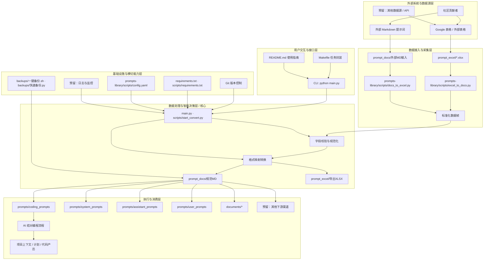
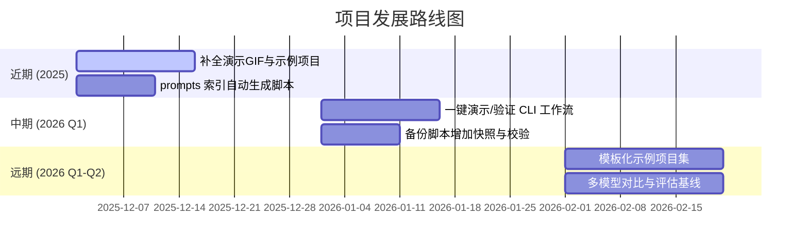

<!--
-------------------------------------------------------------------------------
  项目头部区域 (HEADER)
-------------------------------------------------------------------------------
-->
<p align="center">
  <!-- 建议尺寸: 1280x640px。可以使用 Canva, Figma 或 https://banners.beyondco.de/ 等工具制作 -->
  
</p>

<div align="center">

# vibe coding 至尊超级终极无敌指南 V114514

**一个通过与 AI 结对编程，将想法变为现实的终极工作站**

---

<!--
  徽章区域 (BADGES)
-->
<p>
  <a href="https://github.com/tukuaiai/vibe-coding-cn/actions"></a>
  <a href="https://github.com/tukuaiai/vibe-coding-cn/releases"></a>
  <a href="LICENSE"></a>
  <a href="https://github.com/tukuaiai/vibe-coding-cn"></a>
  <a href="https://github.com/tukuaiai/vibe-coding-cn"></a>
  <a href="https://github.com/tukuaiai/vibe-coding-cn/graphs/contributors"></a>
  <a href="https://t.me/glue_coding"></a>
</p>

[📚 相关文档](#-相关文档) •
[🚀 入门指南](#-入门指南) •
[⚙️ 完整设置流程](#️-完整设置流程) •
[🤝 参与贡献](#-参与贡献)

</div>

---

## 🖼️ 概览

**Vibe Coding** 是一个与 AI 结对编程的终极工作流程，旨在帮助开发者丝滑地将想法变为现实。本指南详细介绍了从项目构思、技术选型、实施规划到具体开发、调试和扩展的全过程，强调以**规划驱动**和**模块化**为核心，避免让 AI 失控导致项目混乱。

> **核心理念**: *规划就是一切。* 谨慎让 AI 自主规划，否则你的代码库会变成一团无法管理的乱麻。

## 📋 道

## 📋 法

## 📋 器术

## 📋 器
- **Claude Opus 4.5**，在 Claude Code 中使用 很贵，但是尼区ios订阅要便宜几百人民币，快+效果好，顶中顶中顶
- **gpt-5.1-codex.1-codex (xhigh)**，在 Codex CLI 中使用，顶中顶，除了慢其他没得挑，大项目复杂逻辑唯一解
- **Droid**，这个里面的 Claude Opus 4.5比 Claude Code 还强，顶
- **Kiro**，这个里面的 Claude Opus 4.5 现在免费，就是cli有点拉，看不到正在运行的情况
- **gemini**，cli免费用，干脏活，用cc或者codex写好的脚本，拿他来执行可以，整理文档和找思路就它了

---

## 📚 相关文档/资源

- [**vibecoding交流群**](https://t.me/glue_coding)
- [**我的频道**](https://t.me/tradecat_ai_channel)
- [**小登论道：我的学习经验**](./documents/小登论道.md)
- [**编程书籍推荐**](./documents/编程书籍推荐.md)
- [**skill生成器，把任何资料转agent的skill（技能）**](https://github.com/yusufkaraaslan/Skill_Seekers)
- [**google表格提示词数据库，我系统性收集和制作的几百个适用于各个场景的用户提示词和系统提示词在线表格**](https://docs.google.com/spreadsheets/d/1ngoQOhJqdguwNAilCl1joNwTje7FWWN9WiI2bo5VhpU/edit?gid=2093180351#gid=2093180351&range=A1)
- [**系统提示词收集仓库**](https://github.com/x1xhlol/system-prompts-and-models-of-ai-tools)
- [**prompts-library 提示词库xlsx与md文件夹互转工具与使用说明，有几百个适用于各个领域的提示词与元提示词**](./prompts-library/)
- [**coding_prompts我收集和制作的几十个vibecoding适用的提示词**](./prompts/coding_prompts/)
- [**代码组织.md**](./documents/代码组织.md)
- [**关于手机ssh任意位置链接本地计算机，基于frp实现的方法.md**](./documents/关于手机ssh任意位置链接本地计算机，基于frp实现的方法.md)
- [**工具集.md**](./documents/工具集.md)
- [**编程之道.md**](./documents/编程之道.md)
- [**胶水编程.md**](./documents/胶水编程.md)
- [**gluecoding.md**](./documents/gluecoding.md)
- [**CONTRIBUTING.md**](./CONTRIBUTING.md)
- [**CODE_OF_CONDUCT.md**](./CODE_OF_CONDUCT.md)
- [**系统提示词构建原则.md**](./documents/系统提示词构建原则.md) - 深入探讨构建高效、可靠AI系统提示词的核心原则、沟通互动、任务执行、编码规范与安全防护等全方位指南。
- [**开发经验.md**](./documents/开发经验.md) - 包含变量命名、文件结构、编码规范、系统架构原则、微服务、Redis和消息队列等开发经验与项目规范的详细整理。
- [**vibe-coding-经验收集.md**](./documents/vibe-coding-经验收集.md) - AI开发最佳实践与系统提示词优化技巧的经验收集。
- [**通用项目架构模板.md**](./documents/通用项目架构模板.md) - 提供了多种项目类型的标准目录结构、核心设计原则、最佳实践建议及技术选型参考。
- [**auggie-mcp 详细配置文档**](./documents/auggie-mcp配置文档.md) - augment上下文引擎mcp，非常好用。
- [**system_prompts/**](./prompts/system_prompts/) - AI开发系统提示词集合，包含多版本开发规范与思维框架（1-8号配置）。
  - `1/CLAUDE.md` - 开发者行为准则与工程规范
  - `2/CLAUDE.md` - ultrathink模式与架构可视化规范
  - `3/CLAUDE.md` - 思维创作哲学与执行确认机制
  - `4/CLAUDE.md` - Linus级工程师服务认知架构
  - `5/CLAUDE.md` - 顶级程序员思维框架与代码品味
  - `6/CLAUDE.md` - 综合版本，整合所有最佳实践
  - `7/CLAUDE.md` - 推理与规划智能体，专职复杂任务分解与高可靠决策支持
  - `8/CLAUDE.md` - 最新综合版本，顶级程序员服务Linus级工程师，包含完整元规则与认知架构
  - `9/CLAUDE.md` - 失败的简化版本，效果不行
  - `10/CLAUDE.md` - 最新综合版本，加入了augment上下文引擎的使用规范与要求

---

## ✉️ 联系方式

- **GitHub**: [tukuaiai](https://github.com/tukuaiai)
- **Telegram**: [@desci0](https://t.me/desci0)
- **X (Twitter)**: [@123olp](https://x.com/123olp)
- **Email**: `tukuai.ai@gmail.com`

---

### 项目目录结构概览

本项目 `vibe-coding-cn` 的核心结构主要围绕知识管理、AI 提示词的组织与自动化展开。以下是经过整理和简化的目录树及各部分说明：

```
.
├── CODE_OF_CONDUCT.md           # 社区行为准则，规范贡献者行为。
├── CONTRIBUTING.md              # 贡献指南，说明如何为本项目做出贡献。
├── GEMINI.md                    # AI 助手的上下文文档，包含项目概述、技术栈和文件结构。
├── LICENSE                      # 开源许可证文件。
├── Makefile                     # 项目自动化脚本，用于代码检查、构建等。
├── README.md                    # 项目主文档，包含项目概览、使用指南、资源链接等。
├── .gitignore                   # Git 忽略文件。
├── AGENTS.md                    # AI 代理相关的文档或配置。
├── CLAUDE.md                    # AI 助手的核心行为准则或配置。
│
├── documents/                   # 存放各类说明文档、经验总结和配置详细说明。
│   ├── auggie-mcp配置文档.md      # Augment 上下文引擎配置文档。
│   ├── 代码组织.md                # 代码组织与结构相关文档。
│   ├── ... (其他文档)
│
├── libs/                        # 通用库代码，用于项目内部模块化。
│   ├── common/                  # 通用功能模块。
│   │   ├── __init__.py          # Python 包初始化文件。
│   │   ├── models/              # 模型定义。
│   │   │   └── __init__.py
│   │   └── utils/               # 工具函数。
│   │       └── __init__.py
│   ├── database/                # 数据库相关模块。
│   │   └── .gitkeep             # 占位文件，确保目录被 Git 跟踪。
│   └── external/                # 外部集成模块。
│       └── .gitkeep             # 占位文件，确保目录被 Git 跟踪。
│
├── prompts/                     # 集中存放所有类型的 AI 提示词。
│   ├── assistant_prompts/       # 辅助类提示词。
│   ├── coding_prompts/          # 专门用于编程和代码生成相关的提示词集合。
│   │   ├── ... (具体编程提示词文件)
│   │
│   ├── prompts-library/         # 提示词库管理工具（Excel-Markdown 转换）
│   │   ├── main.py              # 提示词库管理工具主入口。
│   │   ├── scripts/             # 包含 Excel 与 Markdown 互转脚本和配置。
│   │   ├── prompt_excel/        # 存放 Excel 格式的原始提示词数据。
│   │   ├── prompt_docs/         # 存放从 Excel 转换而来的 Markdown 提示词文档。
│   │   ├── ... (其他 prompts-library 内部文件)
│   │
│   ├── system_prompts/          # AI 系统级提示词，用于设定 AI 行为和框架。
│   │   ├── CLAUDE.md/           # （注意：此路径下文件和目录同名，可能需用户确认）
│   │   ├── ... (其他系统提示词)
│   │
│   └── user_prompts/            # 用户自定义或常用提示词。
│       ├── ASCII图生成.md         # ASCII 艺术图生成提示词。
│       ├── 数据管道.md            # 数据管道处理提示词。
│       ├── ... (其他用户提示词)
│
└── backups/                     # 项目备份脚本。
    ├── 一键备份.sh                # 一键执行备份的 Shell 脚本。
    └── 快速备份.py                # 实际执行逻辑的 Python 脚本。
```

---

## 🖼️ 概览与演示

一句话：Vibe Coding = **规划驱动 + 上下文固定 + AI 结对执行**，让「从想法到可维护代码」变成一条可审计的流水线，而不是一团无法迭代的巨石文件。

**你能得到**
- 成体系的提示词工具链：`prompts/system_prompts/` 约束 AI 行为边界，`prompts/coding_prompts/` 提供需求澄清、计划、执行的全链路脚本。
- 闭环交付路径：需求 → 上下文文档 → 实施计划 → 分步实现 → 自测 → 进度记录，全程可复盘、可移交。
- 共享记忆库：在 `memory-bank/`（或你的等价目录）同步 `project-context.md`、`progress.md` 等，让人类与 AI 共用同一真相源。

**3 分钟 CLI 演示（在 Codex CLI / Claude Code 中按顺序执行即可）**
1) 复制你的需求，加载 `prompts/coding_prompts/(1,1)_#_📘_项目上下文文档生成_·_工程化_Prompt（专业优化版）.md` 生成 `project-context.md`。
2) 加载 `prompts/coding_prompts/(3,1)_#_流程标准化.md`，得到可执行的实施计划与每步验收方式。
3) 使用 `prompts/coding_prompts/(5,1)_{content#_🚀_智能需求理解与研发导航引擎（Meta_R&D_Navigator_·.md` 驱动 AI 按计划写代码；每完成一项就更新 `progress.md` 并运行计划中的测试或 `make test`。

**录屏要点（便于替换成 GIF）**
- 画面 1：粘贴需求 → 自动生成上下文文档。
- 画面 2：生成实施计划，勾选 3–5 个任务。
- 画面 3：AI 写出首个模块并跑通测试结果。
- 建议将录屏保存为 `documents/assets/vibe-coding-demo.gif`，再替换下方链接。

<p align="center">
  
</p>

**演示剧本（文字版，可直接喂给 AI 使用）**
- 需求示例：帮我用 FastAPI 写一个带 Redis 缓存的天气查询服务（含 Dockerfile 和基础测试）。
- 提醒 AI：按上述 1→2→3 的 prompt 顺序执行；每一步必须给出验收指令；禁止生成单文件巨石。
- 验收标准：接口返回示例、`docker build` 与 `pytest` 全部通过；README 需补充使用说明与架构摘要。

> 想快速试水，把自己的需求原样贴给 AI，按 1-2-3 的 prompt 串起来，就能得到可落地、可验证、可维护的交付流程。

---

## ⚙️ 架构与工作流程

核心资产映射：
```
prompts/
  coding_prompts/        # 需求澄清、计划、执行链的核心提示词
  system_prompts/        # 约束 AI 行为边界的系统级提示词
  assistant_prompts/     # 辅助/配合型提示
  user_prompts/          # 可复用的用户侧提示词
  prompts-library/       # Excel↔Markdown 提示词转换与索引工具
documents/
  代码组织.md, 通用项目架构模板.md, 开发经验.md, 系统提示词构建原则.md 等知识库
backups/
  一键备份.sh, 快速备份.py  # 本地/远端快照脚本
```



---

<details>
<summary>📈 性能基准 (可选)</summary>

本仓库定位为「流程与提示词」而非性能型代码库，建议跟踪下列可观测指标（当前主要依赖人工记录，可在 `progress.md` 中打分/留痕）：

| 指标 | 含义 | 当前状态/建议 |
|:---|:---|:---|
| 提示命中率 | 一次生成即满足验收的比例 | 待记录；每个任务完成后在 progress.md 记 0/1 |
| 周转时间 | 需求 → 首个可运行版本所需时间 | 录屏时标注时间戳，或用 CLI 定时器统计 |
| 变更可复盘度 | 是否同步更新上下文/进度/备份 | 通过手工更新；可在 backups 脚本中加入 git tag/快照 |
| 例程覆盖 | 是否有最小可运行示例/测试 | 建议每个示例项目保留 README+测试用例 |

</details>

---

## 🗺️ 路线图



---

## 🚀 入门指南（这里是原作者的，不是我写的，我更新了一下我认为最好的模型）
要开始 Vibe Coding，你只需要以下两种工具之一：
- **Claude Opus 4.5**，在 Claude Code 中使用
- **gpt-5.1-codex.1-codex (xhigh)**，在 Codex CLI 中使用

本指南同时适用于 CLI 终端版本和 VSCode 扩展版本（Codex 和 Claude Code 都有扩展，且界面更新）。

*(注：本指南早期版本使用的是 **Grok 3**，后来切换到 **Gemini 2.5 Pro**，现在我们使用的是 **Claude 4.5**（或 **gpt-5.1-codex.1-codex (xhigh)**）)*

*(注2：如果你想使用 Cursor，请查看本指南的 [1.1 版本](https://github.com/EnzeD/vibe-coding/tree/1.1.1)，但我们认为它目前不如 Codex CLI 或 Claude Code 强大)*

---

<details>
<summary><strong>⚙️ 完整设置流程</strong></summary>

<details>
<summary><strong>1. 游戏设计文档（Game Design Document）</strong></summary>

- 把你的游戏创意交给 **gpt-5.1-codex** 或 **Claude Opus 4.5**，让它生成一份简洁的 **游戏设计文档**，格式为 Markdown，文件名为 `game-design-document.md`。
- 自己审阅并完善，确保与你的愿景一致。初期可以很简陋，目标是给 AI 提供游戏结构和意图的上下文。不要过度设计，后续会迭代。
</details>

<details>
<summary><strong>2. 技术栈与 <code>CLAUDE.md</code> / <code>Agents.md</code></strong></summary>

- 让 **gpt-5.1-codex** 或 **Claude Opus 4.5** 为你的游戏推荐最合适的技术栈（例如：多人3D游戏用 ThreeJS + WebSocket），保存为 `tech-stack.md`。
  - 要求它提出 **最简单但最健壮** 的技术栈。
- 在终端中打开 **Claude Code** 或 **Codex CLI**，使用 `/init` 命令，它会读取你已创建的两个 .md 文件，生成一套规则来正确引导大模型。
- **关键：一定要审查生成的规则。** 确保规则强调 **模块化**（多文件）和禁止 **单体巨文件**（monolith）。可能需要手动修改或补充规则。
  - **极其重要：** 某些规则必须设为 **"Always"**（始终应用），确保 AI 在生成任何代码前都强制阅读。例如添加以下规则并标记为 "Always"：
    > ```
    > # 重要提示：
    > # 写任何代码前必须完整阅读 memory-bank/@architecture.md（包含完整数据库结构）
    > # 写任何代码前必须完整阅读 memory-bank/@game-design-document.md
    > # 每完成一个重大功能或里程碑后，必须更新 memory-bank/@architecture.md
    > ```
  - 其他（非 Always）规则要引导 AI 遵循你技术栈的最佳实践（如网络、状态管理等）。
  - *如果想要代码最干净、项目最优化，这一整套规则设置是强制性的。*
</details>

<details>
<summary><strong>3. 实施计划（Implementation Plan）</strong></summary>

- 将以下内容提供给 **gpt-5.1-codex** 或 **Claude Opus 4.5**：
  - 游戏设计文档（`game-design-document.md`）
  - 技术栈推荐（`tech-stack.md`）
- 让它生成一份详细的 **实施计划**（Markdown 格式），包含一系列给 AI 开发者的分步指令。
  - 每一步要小而具体。
  - 每一步都必须包含验证正确性的测试。
  - 严禁包含代码——只写清晰、具体的指令。
  - 先聚焦于 **基础游戏**，完整功能后面再加。
</details>

<details>
<summary><strong>4. 记忆库（Memory Bank）</strong></summary>

- 新建项目文件夹，并在 VSCode 中打开。
- 在项目根目录下创建子文件夹 `memory-bank`。
- 将以下文件放入 `memory-bank`：
  - `game-design-document.md`
  - `tech-stack.md`
  - `implementation-plan.md`
  - `progress.md`（新建一个空文件，用于记录已完成步骤）
  - `architecture.md`（新建一个空文件，用于记录每个文件的作用）
</details>

</details>

<details>
<summary><strong>🎮 Vibe Coding 开发基础游戏</strong></summary>

现在进入最爽的阶段！

<details>
<summary><strong>确保一切清晰</strong></summary>

- 在 VSCode 扩展中打开 **Codex** 或 **Claude Code**，或者在项目终端启动 Claude Code / Codex CLI。
- 提示词：阅读 `/memory-bank` 里所有文档，`implementation-plan.md` 是否完全清晰？你有哪些问题需要我澄清，让它对你来说 100% 明确？
- 它通常会问 9-10 个问题。全部回答完后，让它根据你的回答修改 `implementation-plan.md`，让计划更完善。
</details>

<details>
<summary><strong>你的第一个实施提示词</strong></summary>

- 打开 **Codex** 或 **Claude Code**（扩展或终端）。
- 提示词：阅读 `/memory-bank` 所有文档，然后执行实施计划的第 1 步。我会负责跑测试。在我验证测试通过前，不要开始第 2 步。验证通过后，打开 `progress.md` 记录你做了什么供后续开发者参考，再把新的架构洞察添加到 `architecture.md` 中解释每个文件的作用。
- **永远** 先用 "Ask" 模式或 "Plan Mode"（Claude Code 中按 `shift+tab`），确认满意后再让 AI 执行该步骤。
- **极致 Vibe：** 安装 [Superwhisper](https://superwhisper.com)，用语音随便跟 Claude 或 gpt-5.1-codex 聊天，不用打字。
</details>

<details>
<summary><strong>工作流</strong></summary>

- 完成第 1 步后：
  - 把改动提交到 Git（不会用就问 AI）。
  - 新建聊天（`/new` 或 `/clear`）。
  - 提示词：阅读 memory-bank 所有文件，阅读 progress.md 了解之前的工作进度，然后继续实施计划第 2 步。在我验证测试前不要开始第 3 步。
- 重复此流程，直到整个 `implementation-plan.md` 全部完成。
</details>

</details>

<details>
<summary><strong>✨ 添加细节功能</strong></summary>

恭喜！你已经做出了基础游戏！可能还很粗糙、缺少功能，但现在可以尽情实验和打磨了。
- 想要雾效、后期处理、特效、音效？更好的飞机/汽车/城堡？绝美天空？
- 每增加一个主要功能，就新建一个 `feature-implementation.md`，写短步骤+测试。
- 继续增量式实现和测试。

</details>

<details>
<summary><strong>🐞 修复 Bug 与卡壳情况</strong></summary>

<details>
<summary><strong>常规修复</strong></summary>

- 如果某个提示词失败或搞崩了项目：
  - Claude Code 用 `/rewind` 回退；用 gpt-5.1-codex 的话多提交 git，需要时 reset。
- 报错处理：
  - **JavaScript 错误：** 打开浏览器控制台（F12），复制错误，贴给 AI；视觉问题截图发给它。
  - **懒人方案：** 安装 [BrowserTools](https://browsertools.agentdesk.ai/installation)，自动复制错误和截图。
</details>

<details>
<summary><strong>疑难杂症</strong></summary>

- 实在卡住：
  - 回退到上一个 git commit（`git reset`），换新提示词重试。
- 极度卡壳：
  - 用 [RepoPrompt](https://repoprompt.com/) 或 [uithub](https://uithub.com/) 把整个代码库合成一个文件，然后丢给 **gpt-5.1-codex 或 Claude** 求救。
</details>

</details>

<details>
<summary><strong>💡 技巧与窍门</strong></summary>

<details>
<summary><strong>Claude Code & Codex 使用技巧</strong></summary>

- **终端版 Claude Code / Codex CLI：** 在 VSCode 终端里运行，能直接看 diff、喂上下文，不用离开工作区。
- **Claude Code 的 `/rewind`：** 迭代跑偏时一键回滚到之前状态。
- **自定义命令：** 创建像 `/explain $参数` 这样的快捷命令，触发提示词：“深入分析代码，彻底理解 $参数 是怎么工作的。理解完告诉我，我再给你任务。” 让模型先拉满上下文再改代码。
- **清理上下文：** 经常用 `/clear` 或 `/compact`（保留历史对话）。
- **省时大法（风险自负）：** 用 `claude --dangerously-skip-permissions` 或 `codex --yolo`，彻底关闭确认弹窗。
</details>

<details>
<summary><strong>其他实用技巧</strong></summary>

- **小修改：** 用 gpt-5.1-codex (medium)
- **写顶级营销文案：** 用 Opus 4.1
- **生成优秀 2D 精灵图：** 用 ChatGPT + Nano Banana
- **生成音乐：** 用 Suno
- **生成音效：** 用 ElevenLabs
- **生成视频：** 用 Sora 2
- **提升提示词效果：**
  - 加一句：“慢慢想，不着急，重要的是严格按我说的做，执行完美。如果我表达不够精确请提问。”
  - 在 Claude Code 中触发深度思考的关键词强度：`think` < `think hard` < `think harder` < `ultrathink`。
</details>

</details>

<details>
<summary><strong>❓ 常见问题解答 (FAQ)</strong></summary>

- **Q: 我在做应用不是游戏，这个流程一样吗？**
  - **A:** 基本完全一样！把 GDD 换成 PRD（产品需求文档）即可。你也可以先用 v0、Lovable、Bolt.new 快速原型，再把代码搬到 GitHub，然后克隆到本地用本指南继续开发。

- **Q: 你那个空战游戏的飞机模型太牛了，但我一个提示词做不出来！**
  - **A:** 那不是一个提示词，是 ~30 个提示词 + 专门的 `plane-implementation.md` 文件引导的。用精准指令如“在机翼上为副翼切出空间”，而不是“做一个飞机”这种模糊指令。

- **Q: 为什么现在 Claude Code 或 Codex CLI 比 Cursor 更强？**
  - **A:** 完全看个人喜好。我们强调的是：Claude Code 能更好发挥 Claude Opus 4.5 的实力，Codex CLI 能更好发挥 gpt-5.1-codex 的实力，而 Cursor 对这两者的利用都不如原生终端版。终端版还能在任意 IDE、使用 SSH 远程服务器等场景工作，自定义命令、子代理、钩子等功能也能长期大幅提升开发质量和速度。最后，即使你只是低配 Claude 或 ChatGPT 订阅，也完全够用。

- **Q: 我不会搭建多人游戏的服务器怎么办？**
  - **A:** 问你的 AI。

</details>

---

## 🤝 参与贡献

我们热烈欢迎各种形式的贡献！如果您对本项目有任何想法或建议，请随时开启一个 [Issue](https://github.com/tukuaiai/vibe-coding-cn/issues) 或提交一个 [Pull Request](https://github.com/tukuaiai/vibe-coding-cn/pulls)。

在您开始之前，请花点时间阅读我们的 [**贡献指南 (CONTRIBUTING.md)**](CONTRIBUTING.md) 和 [**行为准则 (CODE_OF_CONDUCT.md)**](CODE_OF_CONDUCT.md)。

### ✨ 贡献者们

感谢所有为本项目做出贡献的开发者！

<a href="https://github.com/tukuaiai/vibe-coding-cn/graphs/contributors">
  
  
</a>

---

## 📜 许可证

本项目采用 [MIT](LICENSE) 许可证。

---

<div align="center">

**如果这个项目对您有帮助，请不要吝啬您的 Star ⭐！**

## Star History

<a href="https://www.star-history.com/#tukuaiai/vibe-coding-cn&type=date&legend=top-left">
 <picture>
   <source media="(prefers-color-scheme: dark)" srcset="https://api.star-history.com/svg?repos=tukuaiai/vibe-coding-cn&type=date&theme=dark&legend=top-left" />
   <source media="(prefers-color-scheme: light)" srcset="https://api.star-history.com/svg?repos=tukuaiai/vibe-coding-cn&type=date&legend=top-left" />
   
 </picture>
</a>

---

## ✨ 赞助地址

您的支持是我们持续改进项目的动力！

-   **Tron (TRC20)**: `TQtBXCSTwLFHjBqTS4rNUp7ufiGx51BRey`
-   **Solana**: `HjYhozVf9AQmfv7yv79xSNs6uaEU5oUk2USasYQfUYau`
-   **Ethereum (ERC20)**: `0xa396923a71ee7D9480b346a17dDeEb2c0C287BBC`
-   **BNB Smart Chain (BEP20)**: `0xa396923a71ee7D9480b346a17dDeEb2c0C287BBC`
-   **Bitcoin**: `bc1plslluj3zq3snpnnczplu7ywf37h89dyudqua04pz4txwh8z5z5vsre7nlm`
-   **Sui**: `0xb720c98a48c77f2d49d375932b2867e793029e6337f1562522640e4f84203d2e`

**Made with ❤️ and a lot of ☕ by [tukuaiai](https://github.com/tukuaiai),[Nicolas Zullo](https://x.com/NicolasZu)and [123olp](https://x.com/123olp)**

[⬆ 回到顶部](#vibe-coding-终极指南-v12)
